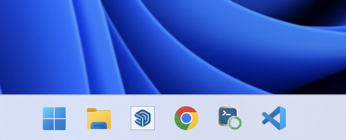
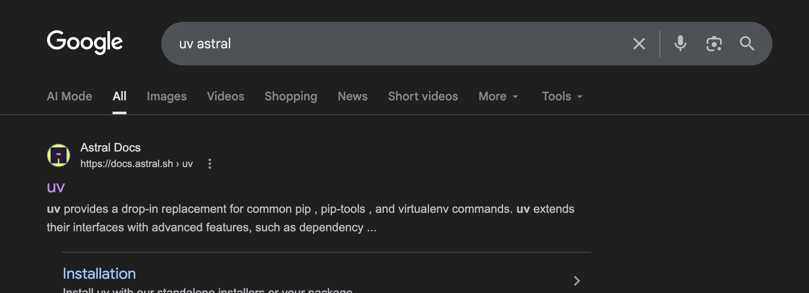
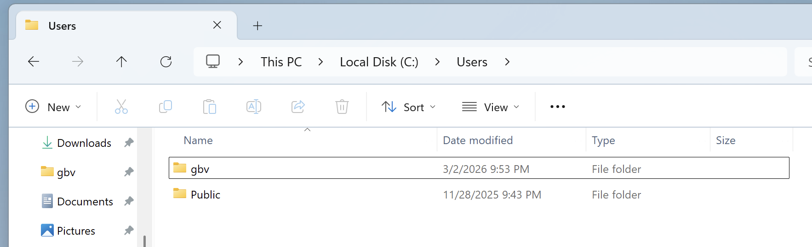
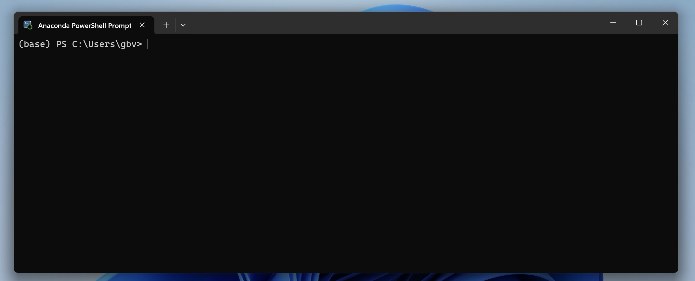
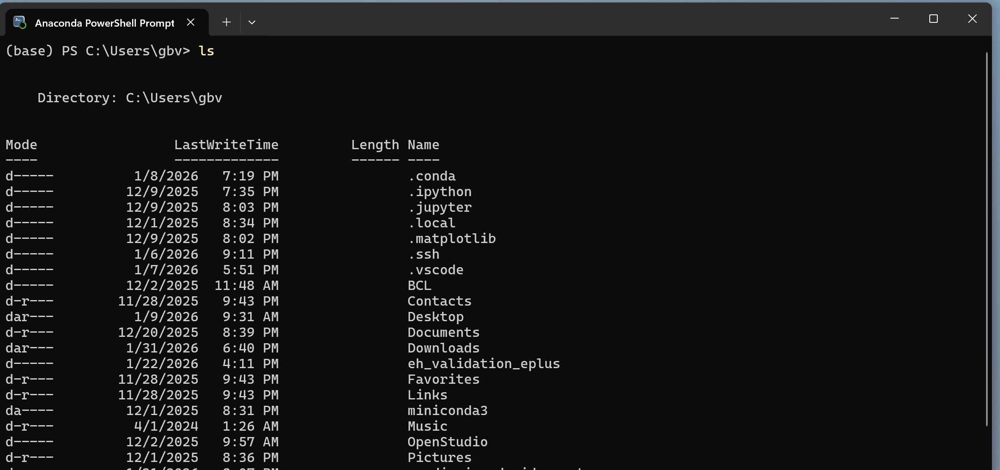
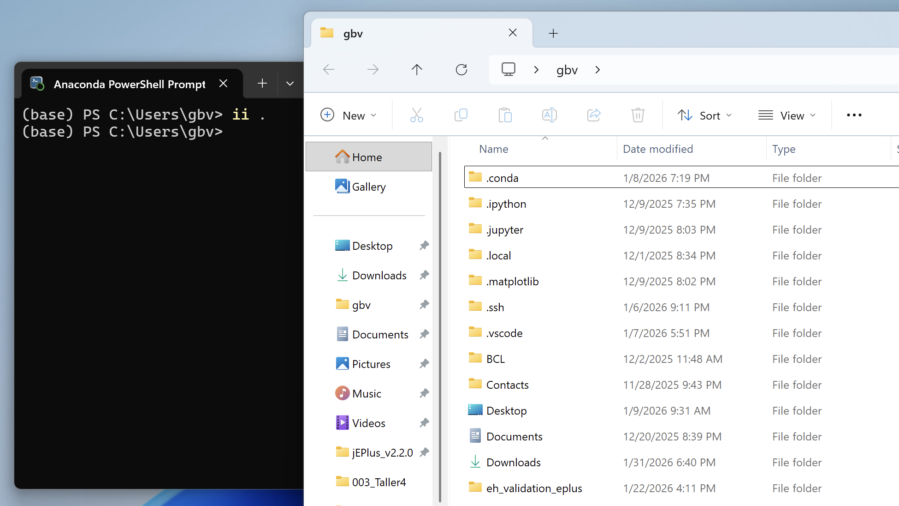

## Ecosistema HackODS UNAM 2026   


<br>

<br>

- Python
- uv (ambiente virtual)
- uso básico de terminal
- Jupyter notebook

## Objetivo


<br>
<br>

```python
print('Hola mundo')
```

<br>
<br>
En Jupyter notebook

## ¿Por qué Python?

<br>

- **Software libre** y gratuito
- **Multiplataforma** (Windows, macOS, Linux)
- **Multipropósito** (web, automatización, ciencia, IA…)
- Lenguaje con **mayor crecimiento** en la última década
- **Lenguaje preferido** en ciencia de datos


## ¿Por qué Miniconda?

<br>

- Distribución **gratuita** de Python
- Muy **ligera** (~80 MB de instalación inicial)
- Altamente **personalizable**: instala solo lo que necesitas
- Incluye una **terminal propia** que funciona bien para todo lo que haremos


## ¿Por qué ambientes virtuales?

<br>

- **Aíslan** las dependencias de cada proyecto
- Mejoran la **reproducibilidad**
- Algunos sistemas **solo permiten** instalar paquetes en ambientes virtuales
- Evitan conflictos entre versiones de librerías


## ¿Por qué uv?

<br>

- Extremadamente **rápido** (escrito en Rust)
- **No requiere activar** el ambiente → fácil de usar
- Actualiza automáticamente el equivalente al `requirements.txt`
- Reemplaza `pip`, `pip-tools` y `virtualenv` en una sola herramienta
- Se lleva muy bien con repositorios `.gitignore`


## Instalar Python con miniconda


<br>
<br>
<br>

Naveguemos... recuerda **miniconda**.


## Ancla la terminal


<br>
<br>



## Instala uv de Astral

<br>




## Conceptos: HOME

<br>



<br>

```
C:\Users\gbv
```

## Al abrir la terminal de anaconda

<br>



## Lista los archivos


```
ls
```




## El comando `cd`

<br>

**c**hange **d**irectory — cambia de carpeta

<br>

```bash
cd nombre_de_carpeta
```

<br>

La terminal solo "ve" lo que hay en la carpeta actual


## Ir al Escritorio

<br>

```bash
cd Desktop
```

<br>

Ahora estás en:

```
C:\Users\gbv\Desktop
```

para que funcione tiene que `ver` el directorio.


## Ir a Descargas

<br>

Primero regresa a HOME:

```bash
cd ..
```

Luego entra a Descargas:

```bash
cd Downloads
```


## Ir a Documentos

<br>

Regresa a HOME:

```bash
cd ..
```

Entra a Documentos:

```bash
cd Documents
```


## Resumen de `cd`

<br>

| Comando | Acción |
|---------|--------|
| `cd carpeta` | Entra a una carpeta |
| `cd ..` | Sube un nivel  |
| `cd ..\otra` | Sube y entra a otra carpeta |
| `ls` | Enlista archivos y carpetas |
| `ii . ` | Abre explorador de archivos donde estes |

## El comando `ls` (o `dir`)

<br>

Lista el contenido de la carpeta actual

<br>

```bash
ls
```

<br>

En Windows también funciona:

```bash
dir
```


## Explorador de Windows


<br>




## Recomendaciones para nombres


**Nunca** uses en nombres de archivos o carpetas:

 
| Evitar | Ejemplo malo | Ejemplo bueno |
|--------|-------------|---------------|
| Espacios | `mi proyecto` | `mi_proyecto` |
| Acentos | `práctica` | `practica` |
| Eñes | `año` | `anio` |
| Caracteres especiales | `datos (1)` | `datos_1` |

<br>

Usa **minúsculas**, **guiones bajos** `_` o **guiones** `-`


## Crear un proyecto con uv

<br>

Navega al Escritorio:

```bash
cd Desktop
```

<br>

Crea el proyecto:

```bash
uv init proyecto
```

<br>

Entra al proyecto:

```bash
cd proyecto
```


## ¿Qué creó `uv init`?

<br>

```
proyecto/
├── .python-version
├── pyproject.toml
├── README.md
└── main.py
```

<br>

- `pyproject.toml` — configuración del proyecto y dependencias
- `.python-version` — versión de Python a usar


## Instalar paquetes con uv

<br>

Instala Jupyter notebook:

```bash
uv add jupyter notebook
```

<br>

- Crea automáticamente el ambiente virtual (`.venv/`)
- Actualiza `pyproject.toml` con la dependencia
- No necesitas activar nada


## Narrativa computacional

<br>

Organiza tu proyecto con carpetas:

```
proyecto/
├── notebook/       ← tus libretas Jupyter
├── data/           ← datos de entrada
├── pyproject.toml
└── README.md
```

<br>

Crea las carpetas:

```bash
mkdir notebook
mkdir data
```


## Abrir Jupyter notebook

<br>

Desde la carpeta del proyecto:

```bash
uv run jupyter notebook
```

<br>

- Se abre el navegador automáticamente
- Navega a la carpeta `notebook/`
- Clic en **New → Python 3** para crear una libreta


## Hola mundo en Jupyter

<br>

En la primera celda de la libreta escribe:

```python
print('Hola mundo')
```

<br>

Presiona **Shift + Enter** para ejecutar

<br>

La salida aparece debajo de la celda:

```
Hola mundo
```


## Ejercicio práctico

<br>

Vamos a descargar un repositorio y echarlo a andar:

<br>

1. Descarga el ZIP del repositorio (o usa `git clone`)
2. Descomprime en el Escritorio
3. Abre la terminal y navega al folder:

```bash
cd Desktop
cd nombre_del_repo
```


## Ejercicio: instalar y ejecutar

<br>

4. Instala las dependencias:

```bash
uv sync
```

<br>

5. Abre Jupyter:

```bash
uv run jupyter notebook
```

<br>

6. Abre la libreta del folder `notebook/` y ejecútala celda por celda


## Resumen

<br>

| Herramienta | Para qué |
|-------------|----------|
| **Miniconda** | Instalar Python y tener terminal |
| **uv** | Crear proyectos, ambientes e instalar paquetes |
| **Jupyter** | Escribir y ejecutar código interactivamente |

<br>

| Comando | Acción |
|---------|--------|
| `uv init proyecto` | Crear proyecto nuevo |
| `uv add paquete` | Instalar un paquete |
| `uv run jupyter notebook` | Abrir Jupyter |
| `uv sync` | Instalar dependencias de un proyecto existente |


## Recursos

<br>

- [Python](https://www.python.org/)
- [Miniconda](https://docs.anaconda.com/miniconda/)
- [uv (Astral)](https://docs.astral.sh/uv/)
- [Jupyter](https://jupyter.org/)

<br>

**Contacto:**

Guillermo Barrios del Valle — gbv@ier.unam.mx